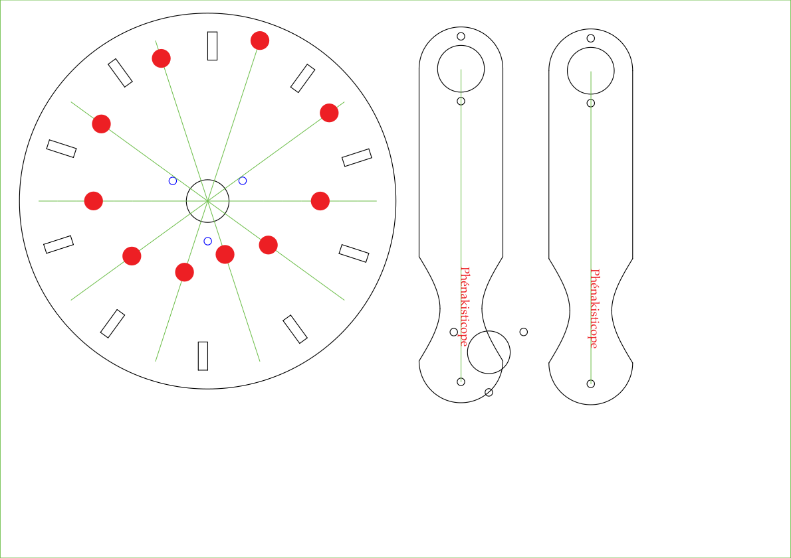
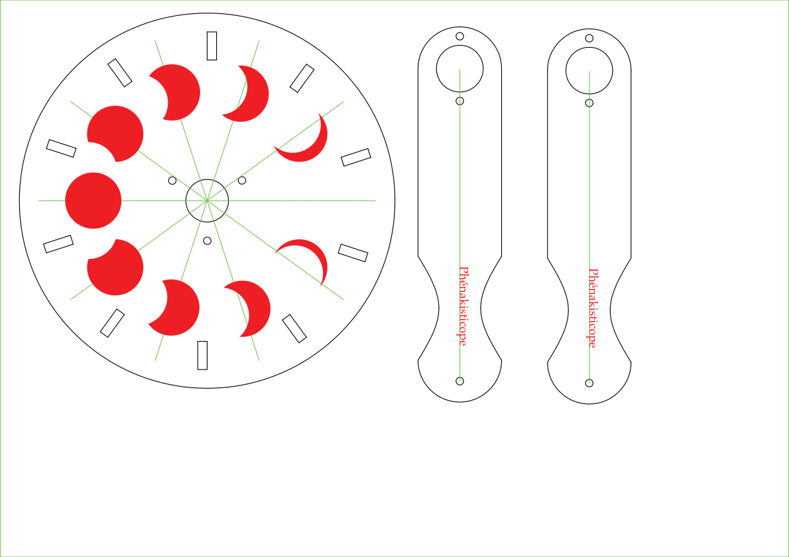

# Laser Cutter Files

The files for the **LaserCutter** contain the main plate with holes and animation, as well as the handles.
The dimension are chosen to nicely fit on a sheet of `3mm` plywood of `DIN A3` size.

# Basic SVG

The basic SVG file contains the lines for cutting the plate, handles and holes.

# Basic pattern

The basic pattern SVG contains the lines for cutting (black), as well as the animation to be engraved (red).
Please ignore the green helper lines for positioning.

# Advanced pattern

The advanced pattern SVG contains the lines for cutting (black), as well as the animation to be engraved (red).
Please ignore the green helper lines for positioning. 

